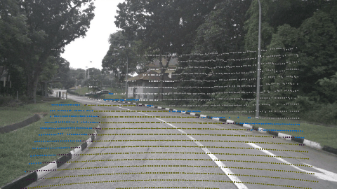
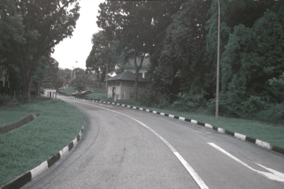
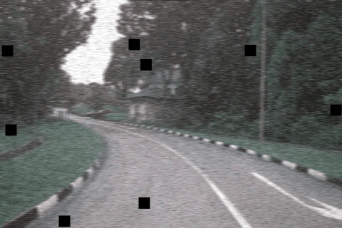

# PatchFusion
PatchFusion: Resilient LiDAR-Camera Fusion for Point Cloud Semantic Segmentation in Autonomous Driving

# Abstract
LiDAR-camera fusion for point cloud semantic segmentation is essential for accurate and reliable 3D perception of autonomous driving system. Contemporary LiDAR-camera fusion approaches predominantly integrate the pixel-level camera features located by projected points to augment the corresponding 3D points, which can be abstractly defined as point-pixel fusion strategy. Despite such point-pixel fusion mode has been proved to be effective and widely used in practice, the strategy has two non-ignorable defects: 1) dependent on precise point-pixel projection correspondence, 2) limited by just using miserably few image information. Besides, the LiDAR-only inference in offline fusion fails to utilize the synchronously obtained images to achieve a dynamic fusion for 3D perception, while LiDAR-camera fusion inference in online fusion still encounters challenges of field of view (FoV) discrepancy between sensors. Moreover, the corruption robustness of LiDAR-camera fusion methods, a crucial factor for the practical reliability of perception systems, has been entirely overlooked in previous researches of point cloud semantic segmentation. Thus, focusing on addressing above challenges, we develop the point-patch fusion mode, and construct PatchFusion framework as a systematical and promising solution to enhance performance and resilience of LiDAR-camera fusion perception in realistic and complex driving scenes. Specifically, in PatchFusion, we propose to leverage cross-attention mechanism to implement high-quality point-patch fusion by automatically searching what information should be highlighted or suppressed from the local patch of image, thereby resisting the attack of projection errors, maximizing the utilization of the high-density image information, and being more robust to the potentially image corruptions. Besides, we integrate the strengths of offline and online fusion modes and propose a bidirectional cross-modality knowledge distillation strategy, aiming to further enhance the performance and robustness for predictions within and outside camera FoV. Finally, to bridge the research gap regarding the corruption robustness of LiDAR-camera fusion methods, we design a specialized dataset corruption suite for public multimodal datasets to simulate complex evaluation conditions by synthesizing projection noises and image corruptions. Extensive experiments on well-known datasets in autonomous driving (SemanticKITTI and nuScenes) demonstrate that PatchFusion can effectively improve the performance and resilience of LiDAR-camera fusion for 3D semantic segmentation on both clean and corrupted datasets.

# Preview
The relevant codes will be available here after paper publication.

# Highlights
    (1) We comprehensively analyze the characteristics and challenges of point-pixel fusion, offline fusion, and online-fusion mode predominantly employed in current LiDAR-camera fusion methods for the first time. Besides, we notice the research gap regarding the corruption robustness of LiDAR-camera fusion methods for 3D semantic segmentation.

    (2) We rethink the task of LiDAR-camera fusion for 3D semantic segmentation to solve the existing challenges. We develop point-patch fusion mode and propose PatchFusion framework based on this conception as a promising solution to systematically address the challenges posed by current fusion-based methods, aiming to enhance performance and resilience of LiDAR-camera fusion perception in realistic and complex driving scenes.

    (3) To simulate complex evaluation conditions, we design a corruption suite of multimodal dataset specialized for 3D semantic segmentation for the first time. Extensive experiments on well-known multimodal datasets demonstrate that PatchFusion can effectively improve the performance and resilience of LiDAR-camera fusion on both clean and corrupted datasets.

# Demo
| Name | Vedio Demo |
|------|------|
| Projection maps on clean nuScenes|  |
| Projection maps with projection noises (corrupted level = 0.4) on corrupted nuScenes |  |
| Images on clean nuScenes|  |
| Images with corruptions (corrupted level = 0.4) on corrupted nuScenes |  |
| PathcFusion's improvements by MSeg3D baseline on clean nuScenes|  |
| PathcFusion's improvements by MSeg3D baseline on corrupted nuScenes |  |
